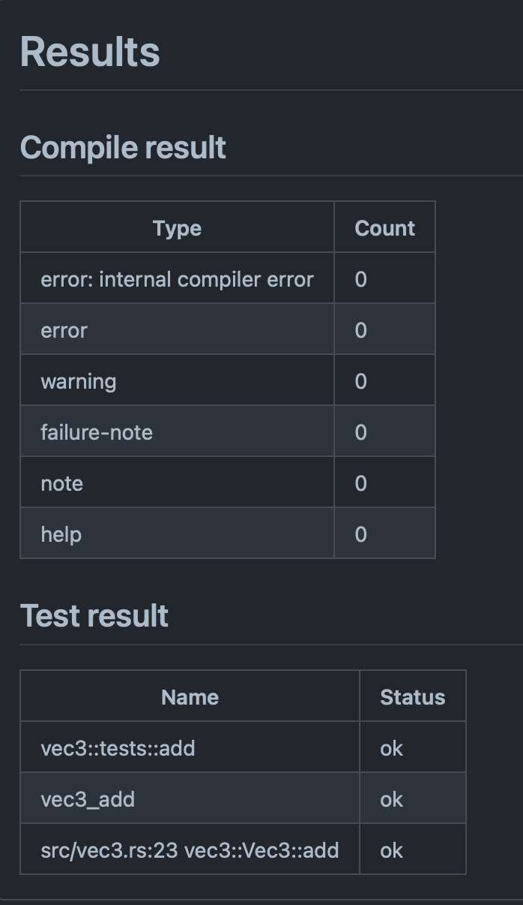
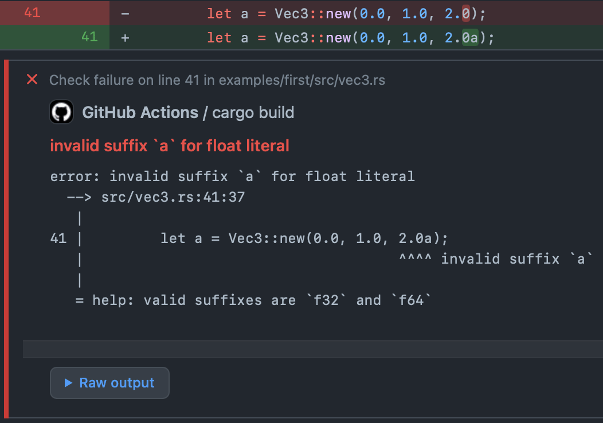
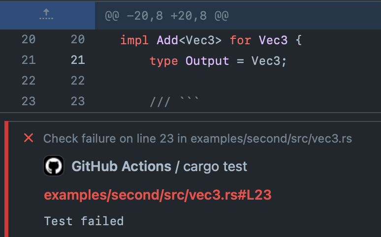

## Integration Rust Cargo with GitHub Actions

### Overview

<table>
    <tr>
        <td rowspan=2 width=45% align=center>
            <h5>General result</h5>
            
        </td>
        <td>
            <h5>Error in code</h5>
            
        </td>
    </tr>
    <tr>
        <td>
            <h5>Failed test</h5>
            
        </td>
    </tr>
</table>

### Inputs

- **Required** `command`: Cargo command like `build`, `check`, `test`, etc.
- `args`: Arguments for the cargo command.
- `manifest-path`: Path to the Cargo.toml. By default, is the working directory.
- `token`: GitHub token. Used for enable more powerful annotation system. *Strongly recommended**
- `toolchain`: Toolchain to use. For example: `nightly`.

_* Default GitHub Actions annotations supports only up to 10 warnings and 10 errors for per the step. With `token` you up this limit to `1000`_

### Outputs

- `notice_count`: Notice count.
- `warning_count`: Warning count.
- `failure_count`: Failure count.

### Example

```yaml

# if `with.token` is used
permissions:
  checks: write

jobs:
  build:
    runs-on: ubuntu-latest
    steps:
      - uses: actions/checkout@v2

      - uses: qRoC/cargo-actions@v1
        with:
          command: build
          args: --verbose
          token: ${{ secrets.GITHUB_TOKEN }}

  code_style:
    continue-on-error: true
    runs-on: ubuntu-latest
    steps:
      - uses: actions/checkout@v2

      - uses: qRoC/cargo-actions@v1
        with:
          command: fmt
          toolchain: nightly
          args: --all -- --check
          token: ${{ secrets.GITHUB_TOKEN }}

  lint:
    continue-on-error: true
    runs-on: ubuntu-latest
    steps:
      - uses: actions/checkout@v2

      - uses: qRoC/cargo-actions@v1
        with:
          command: clippy
          args: --all-features --all-targets -- -D warnings
          token: ${{ secrets.GITHUB_TOKEN }}

  tests:
    runs-on: ubuntu-latest
    steps:
      - uses: actions/checkout@v2

      - uses: qRoC/cargo-actions@v1
        with:
          command: test
          args: --all-features --no-fail-fast --jobs 1
          token: ${{ secrets.GITHUB_TOKEN }}

  audit:
    runs-on: ubuntu-latest
    steps:
      - uses: actions/checkout@v2

      - uses: qRoC/cargo-actions@v1
        with:
          command: audit
```

### For developers

1. Install the dependencies.

```shell
$ yarn install
```

2. Do some changes.

3. Build the typescript and package it for distribution.

```shell
$ yarn build && yarn package
```

3. Run the tests.

```shell
$ yarn test
```

4. Publish changes.

```shell
$ git add -A
$ git commit -m "..."
$ git push origin main
```

5. Move distribution tag.

```shell
git tag -fa v1 -m "Update v1 tag"
git push origin main --force
```
